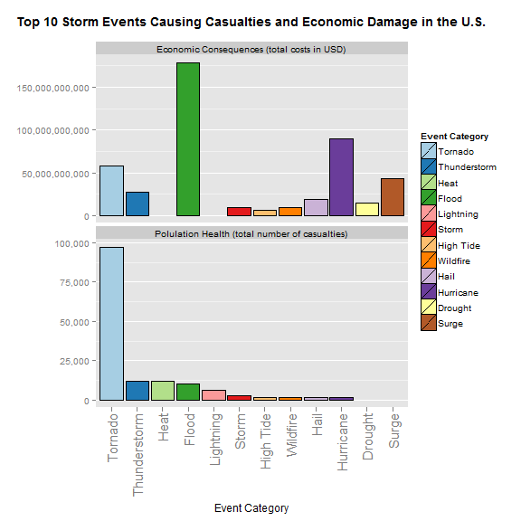

#  Tornados are most harmful storm events with respect to population health

This report identifeis the top 10 storm events that have an impact on population health and economics in the United States. The NOAA Storm Database provided by the U.S. National Oceanic and Atmospheric Administration is used to identify  
* which type of events are most harmful with respect to population health across the U.s. and  
* which type of events have the greatest economic consequences across the U.S. 
  
Based on the recorded events from 1950 to 2011 tornados caused by far most human casualties across the United States.
An economic damage of over 175 billion USD was caused only by floods, followed by hurricanes with nearly 100 billion USD and tornados with over 50 billion USD.


```r
## The following R packages are required: ggplot, stringdist, stringi, scales, xtable.
```


## Data Preprocessing

The raw data is first read into a data table with only the variables used later for the analysis:  
* The variable `EVTYPE` describes the storm event type.  
* The impact on the population health is specified by the sum of the variables `INJURIES` and `FATALITIES`.  
* The variables `PROPDMG`, `PROPDMGEXP`, `CROPDMG` and `CROPDMGEXP` describe the economic consequences (property and crop damage).  
 


```r
if (!file.exists("data")) {
    dir.create("data")    
}
filePathZip <- "./StormData.csv.bz2"

requiredCols <- c("EVTYPE","FATALITIES","INJURIES", "PROPDMG","PROPDMGEXP","CROPDMG","CROPDMGEXP")

library(data.table)
dt_data <- data.table(
    read.csv(filePathZip, sep=",", 
             colClasses=c("FATALITIES"="numeric", "INJURIES"="numeric", "PROPDMG"="numeric", "PROPDMGEXP"="factor",  
                          "CROPDMG"="numeric", "CROPDMGEXP"="factor"))[,requiredCols])
```


### Check for missing values


```r
cnt_obs_na <- sum(as.integer(!complete.cases(dt_data)))
```
There are 0 records in the data set with missing values.
As there are no missing values in the variables of interest we don't need to deal with missing values and/or data imputation.


### Data transformation

In order to calculate the damage costs we first need to transform the factor variables `*EXP` to its numerical representation, 
i.e. 100 for 'H' or 'h', 1000 for 'K' or 'k', 1000000 for 'M' or 'm', and 1000000000 for 'B' or 'b'. All other values will be ignored and therefore set to 0.
Then the damage costs are calculated by multiplying the two numerical columns (each for `PROPDMG` and `CROPDMG`).


```r
## add a new numerical variables *EXPNUM for the *EXP factor variables
dt_data <- dt_data[, PROPDMGEXPNUM := sapply(PROPDMGEXP, 
    function(x) { if (x == 'K' | x == 'k') 1000 
                  else if (x == 'M' | x == 'm') 1000000 
                  else if (x == 'B' | x == 'b') 1000000000 
                  else if (x == 'H' | x == 'h') 100
                  else 0 })] 
dt_data <- dt_data[, PROPDMGNUM := PROPDMG * PROPDMGEXPNUM] 

dt_data <- dt_data[, CROPDMGEXPNUM := sapply(CROPDMGEXP, 
    function(x) { if (x == 'K' | x == 'k') 1000 
                  else if (x == 'M' | x == 'm') 1000000 
                  else if (x == 'B' | x == 'b') 1000000000 
                  else if (x == 'H' | x == 'h') 100
                  else 0 })] 
dt_data <- dt_data[, CROPDMGNUM := CROPDMG * CROPDMGEXPNUM]
```

Grouping of the event type values (variable `EVTYPE`) is done after summarizing the data (see the results section) because the data set with the summarized data is much smaller (there are 985 factor levels in the `EVTYPE` variable).  
Checking the values of the factor levels shows that the following event categories can be used (in alphabetical order):  


```
##  [1] "AVALNACHE"     "BLACK ICE"     "BLIZZARD"      "COLD"         
##  [5] "DAM FAILURE"   "DUST"          "DROUGHT"       "DRY"          
##  [9] "EROSION"       "FIRE"          "FLOOD"         "FOG"          
## [13] "FREEZE"        "FROST"         "FUNNEL"        "GLAZE"        
## [17] "GUSTNADO"      "HAIL"          "HEAT"          "HIGH SEAS"    
## [21] "HIGH TIDE"     "HIGH WATER"    "HURRICANE"     "ICE"          
## [25] "LANDSLIDE"     "LANDSPOUT"     "LIGHTNING"     "LOW TIDE"     
## [29] "MUDSLIDE"      "PRECIPITATION" "RAIN"          "SMOKE"        
## [33] "SNOW"          "SURGE"         "STORM"         "TORNADO"      
## [37] "THUNDERSTORM"  "TSTM"          "VOLCANIC"      "WILDFIRE"     
## [41] "WIND"          "WATERSPOUT"    "WARMTH"        "WET"
```

A string distance calculation is used as strategy for coding the new variable representing the event categories from the list above . 
The category "TSTM" will be re-coded to "THUNDERSTORM" before re-summarizing the data based on the new event category variable as is appears to be an abbreviation word used many times in the data set.


## Results

First we summarize the data by event type and calculate the number of total casualties and the number of total costs. Both sum aggregates can be calculated in one step as the grouping variable is `EVTYPE` in both cases.

```r
## summarize data
dt_data.summary <- dt_data[, list(sum(FATALITIES+INJURIES), sum(PROPDMGNUM+CROPDMGNUM)), by = EVTYPE] ## group by EVTYPE
setnames(dt_data.summary, c("EVTYPE", "TOTAL_CASUALTIES", "TOTAL_COSTS"))
```


### Events that are most harmful with respect to population health

In order to find the top 10 categories (based on the storm events) we proceed as follows:  
* first, all events with a sum of 0 of total casualties are removed  
* second, a category is assigned to the (remaining) events using a string distance calculation between the predefined categories and the events  
* third, the new total of casualties is calculated using the category as the grouping variable now  
* finally, the data set is ordered by the number of total casualties from big to small.   


```r
## first remove records with total casualties of 0 in the summarized data
dt_data.population.health <- dt_data.summary[dt_data.summary$TOTAL_CASUALTIES != 0,]  

## group similar event types together: factor recoding using string distance to category values
library(stringdist)
i <- amatch(dt_data.population.health$EVTYPE, v_ev.cat, maxDist=10)
dt_data.population.health <- dt_data.population.health[, EVCATEGORY := v_ev.cat[i]] ## add new variable EVCATEGORY
dt_data.population.health$EVCATEGORY[dt_data.population.health$EVCATEGORY == "TSTM"] <- "THUNDERSTORM"  ## recode abbrev. event category 
dt_data.population.health$EVCATEGORY <- as.factor(dt_data.population.health$EVCATEGORY)

## re-calculate total casualties by new event category  and order from big to small
dt_data.population.health <- dt_data.population.health[, sum(TOTAL_CASUALTIES),  by=EVCATEGORY]  ## group by EVCATEGORY
setnames(dt_data.population.health, c("EVCATEGORY", "TOTAL"))
dt_data.population.health.ordered <- dt_data.population.health[order(-TOTAL)]  ## order by number of total casualties from big to small

## Convert values of factor variable EVCATEGORY to camel-case and re-order them according to the TOTAL value from big to small
library(stringi)
dt_data.population.health.ordered$EVCATEGORY <- stri_trans_totitle(dt_data.population.health.ordered$EVCATEGORY)
dt_data.population.health.ordered$EVCATEGORY <- reorder(dt_data.population.health.ordered$EVCATEGORY, 
                                                        -dt_data.population.health.ordered$TOTAL)

## print table
library(xtable)
print(xtable(head(dt_data.population.health.ordered, n=10)), type="html")
```

<!-- html table generated in R 3.1.1 by xtable 1.7-3 package -->
<!-- Tue Aug 26 21:22:45 2014 -->
<TABLE border=1>
<TR> <TH>  </TH> <TH> EVCATEGORY </TH> <TH> TOTAL </TH>  </TR>
  <TR> <TD align="right"> 1 </TD> <TD> Tornado </TD> <TD align="right"> 97159.00 </TD> </TR>
  <TR> <TD align="right"> 2 </TD> <TD> Thunderstorm </TD> <TD align="right"> 12081.00 </TD> </TR>
  <TR> <TD align="right"> 3 </TD> <TD> Heat </TD> <TD align="right"> 12047.00 </TD> </TR>
  <TR> <TD align="right"> 4 </TD> <TD> Flood </TD> <TD align="right"> 10064.00 </TD> </TR>
  <TR> <TD align="right"> 5 </TD> <TD> Lightning </TD> <TD align="right"> 6051.00 </TD> </TR>
  <TR> <TD align="right"> 6 </TD> <TD> Storm </TD> <TD align="right"> 2533.00 </TD> </TR>
  <TR> <TD align="right"> 7 </TD> <TD> High Tide </TD> <TD align="right"> 1774.00 </TD> </TR>
  <TR> <TD align="right"> 8 </TD> <TD> Wildfire </TD> <TD align="right"> 1725.00 </TD> </TR>
  <TR> <TD align="right"> 9 </TD> <TD> Hail </TD> <TD align="right"> 1486.00 </TD> </TR>
  <TR> <TD align="right"> 10 </TD> <TD> Hurricane </TD> <TD align="right"> 1457.00 </TD> </TR>
   </TABLE>


### Events that have the greatest economic consequences

In order to find the top 10 categories (based on the storm events) we proceed as follows:  
* first, all events with a sum of 0 of total costs are removed  
* second, a category is assigned to the (remaining) events using a string distance calculation between the predefined categories and the events  
* third, the new total of costs is calculated using the category as the grouping variable now  
* finally, the data set is ordered by the number of total costs from big to small.    


```r
## remove records with totalcosts of 0 in the summarized data
dt_data.economic.damage <- dt_data.summary[dt_data.summary$TOTAL_COSTS != 0,]  

## group similar event types together: factor recoding using string distance to category values
i <- amatch(dt_data.economic.damage$EVTYPE, v_ev.cat, maxDist=10)
dt_data.economic.damage <- dt_data.economic.damage[, EVCATEGORY := v_ev.cat[i]] ## add new variable EVCATEGORY
dt_data.economic.damage$EVCATEGORY[dt_data.economic.damage$EVCATEGORY == "TSTM"] <- "THUNDERSTORM"  ## recode abbrev. event category 
dt_data.economic.damage$EVCATEGORY <- as.factor(dt_data.economic.damage$EVCATEGORY)

## re-calculate total casualties by new event category  and order from big to small
dt_data.economic.damage <- dt_data.economic.damage[, sum(TOTAL_COSTS), by=EVCATEGORY]  ## group by EVCATEGORY
setnames(dt_data.economic.damage, c("EVCATEGORY", "TOTAL"))
dt_data.economic.damage.ordered <- dt_data.economic.damage[order(-TOTAL)]  ## order by total costs from big to small

## Convert values of factor variable EVCATEGORY to camel-case and re-order them according to the TOTAL value from big to small
library(stringi)
dt_data.economic.damage.ordered$EVCATEGORY <- stri_trans_totitle(dt_data.economic.damage.ordered$EVCATEGORY)
dt_data.economic.damage.ordered$EVCATEGORY <- reorder(dt_data.economic.damage.ordered$EVCATEGORY, 
                                                      -dt_data.economic.damage.ordered$TOTAL)

## print table
library(xtable)
print(xtable(head(dt_data.economic.damage.ordered, n=10)), type="html")
```

<!-- html table generated in R 3.1.1 by xtable 1.7-3 package -->
<!-- Tue Aug 26 21:22:45 2014 -->
<TABLE border=1>
<TR> <TH>  </TH> <TH> EVCATEGORY </TH> <TH> TOTAL </TH>  </TR>
  <TR> <TD align="right"> 1 </TD> <TD> Flood </TD> <TD align="right"> 178872208870.00 </TD> </TR>
  <TR> <TD align="right"> 2 </TD> <TD> Hurricane </TD> <TD align="right"> 90161397810.00 </TD> </TR>
  <TR> <TD align="right"> 3 </TD> <TD> Tornado </TD> <TD align="right"> 57500975590.00 </TD> </TR>
  <TR> <TD align="right"> 4 </TD> <TD> Surge </TD> <TD align="right"> 43324041000.00 </TD> </TR>
  <TR> <TD align="right"> 5 </TD> <TD> Thunderstorm </TD> <TD align="right"> 27201811780.00 </TD> </TR>
  <TR> <TD align="right"> 6 </TD> <TD> Hail </TD> <TD align="right"> 18890768570.00 </TD> </TR>
  <TR> <TD align="right"> 7 </TD> <TD> Drought </TD> <TD align="right"> 15025739600.00 </TD> </TR>
  <TR> <TD align="right"> 8 </TD> <TD> Storm </TD> <TD align="right"> 9217040310.00 </TD> </TR>
  <TR> <TD align="right"> 9 </TD> <TD> Wildfire </TD> <TD align="right"> 8894492130.00 </TD> </TR>
  <TR> <TD align="right"> 10 </TD> <TD> High Tide </TD> <TD align="right"> 6678889820.00 </TD> </TR>
   </TABLE>


### Bar plots showing the identified top 10 categories of storm events

The following figure shows the top 10 storm categories in respect of population health and economic consequences respectively.  
Note that  
* the storm categories are ordered by total number of casualties and  
* that both bar plots only show the top 10 categories for their own case.  
  
Camparing both plots side by side shows that there are 8 common storm categories in their individual top 10 rankings, and in both cases there are 2 storm categories which are not in the top 10 ranking of the other case.  
For example, "Heat" is the third most reason affecting the population health whereas it isn't among the 10 highest economic damage costs.


```r
## join data containing only the 10 ten records for both anaylsis
dt_data.top10 <- rbind(dt_data.population.health.ordered[1:10][, TYPE:="Polulation Health (total number of casualties)"],
                       dt_data.economic.damage.ordered[1:10][, TYPE:="Economic Consequences (total costs in USD)"])
setnames(dt_data.top10, c("EVCATEGORY", "TOTAL", "TYPE"))

## make bar plot using facets
library(ggplot2)
g <- ggplot(data=dt_data.top10, aes(x=EVCATEGORY, y=TOTAL))
g <- g + ggtitle("Top 10 Storm Events Causing Casualties and Economic Damage in the U.S.\n") 
g <- g + theme(plot.title = element_text(lineheight=.8, face="bold"))  ## plot title
g <- g + geom_bar(aes(fill=EVCATEGORY), color="black", stat="identity")  ## "identity": variable's value instead of its count
g <- g + scale_fill_brewer(palette="Paired", name="Event Category")  ## set color palette and legend title
g <- g + ylab("") + xlab("Event Category")  ## set axis labels

## scale and rotate ticks on the x-axis and hide the gird lines on x-axis
g <- g + theme(axis.text.x = element_text(angle=90, hjust=1, vjust=0.5, size=15))  ## hjust=1 makes the labels top-aligned
g <- g + theme(panel.grid.minor.x=element_blank(), panel.grid.major.x=element_blank()) 

## define facets based on plot type and let the scale of the y-axis be different for each facet
library(scales)
g <- g + facet_wrap( ~ TYPE, ncol=1, scales="free_y")  
g <- g + scale_y_continuous(labels = comma)  

print(g)
```

 


